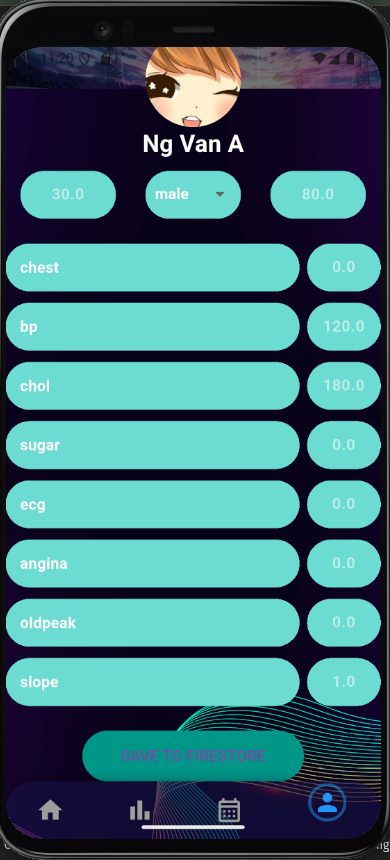
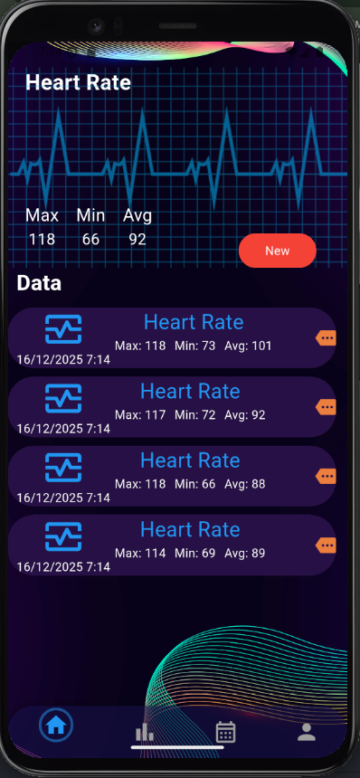
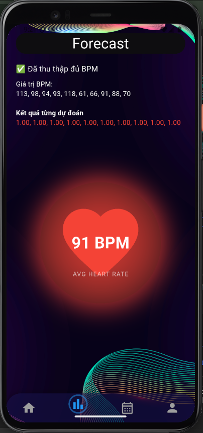
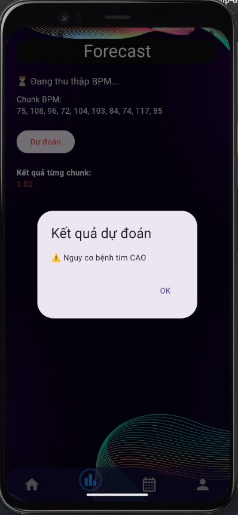

# appfoods

Heart Disease Prediction Application Using Heart Rate Data

## Getting Started

This project is a student-level AI application that predicts heart disease risk using heart rate data measured by the MAX30102 sensor.

The machine learning model was trained on Google Colab and converted to TensorFlow Lite (.tflite) format. The model is integrated into a Flutter mobile app for on-device prediction.

## 📸 Demo

### Home Screen

### Login Screen

### Register Screen

### Personal Info Screen

### Heart Rate Measurement

### Prediction Result

### Notification / History

